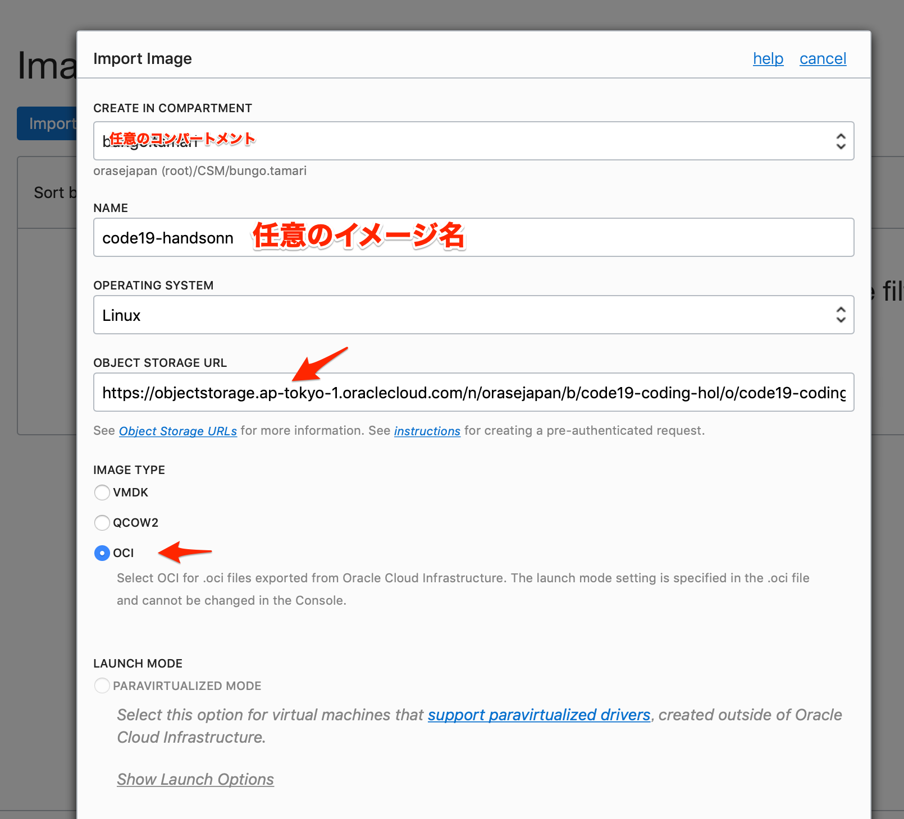
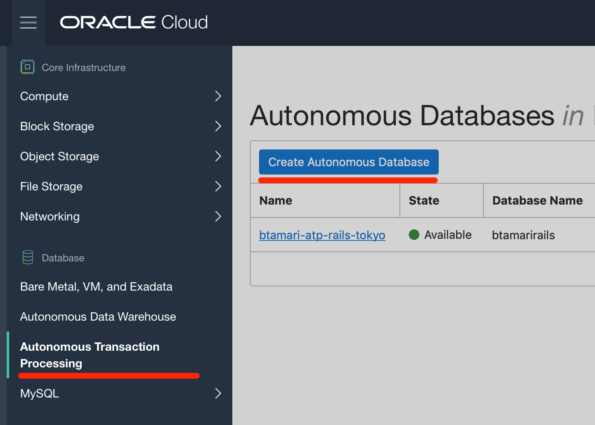
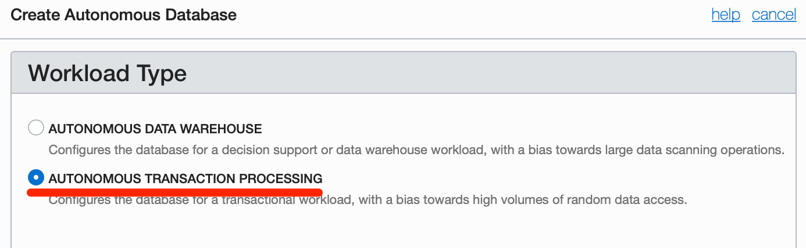
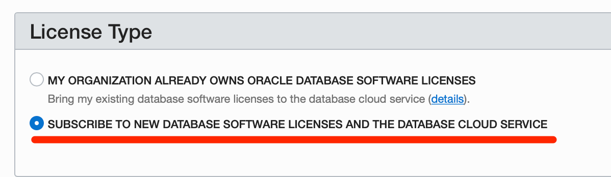
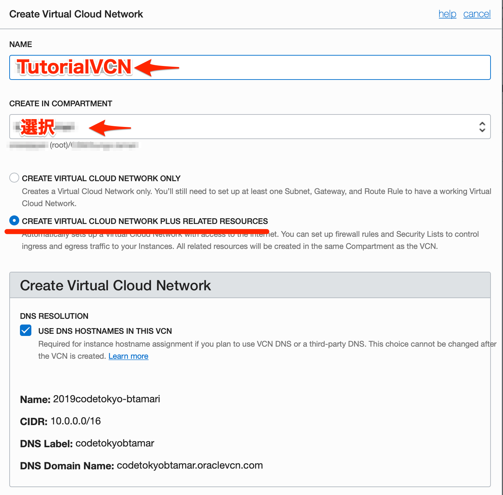
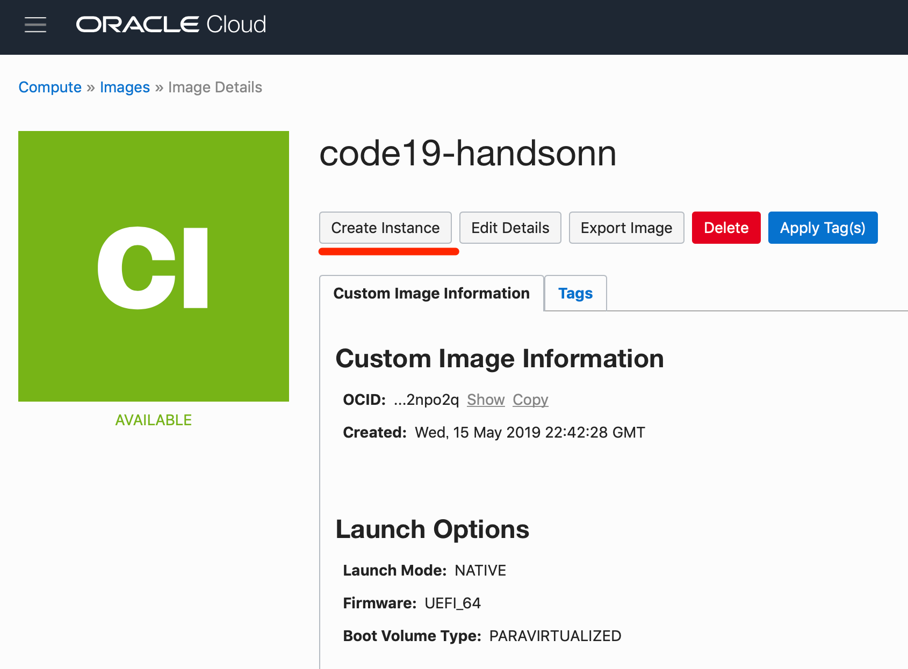
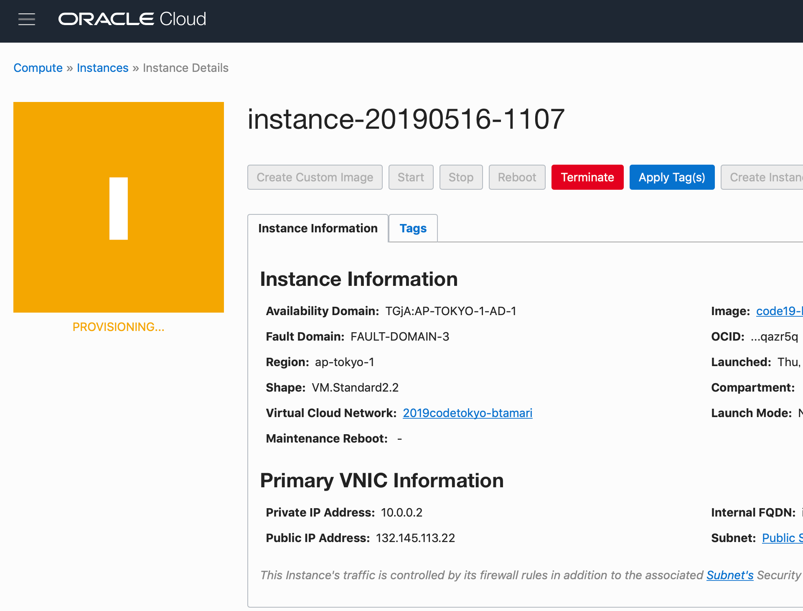
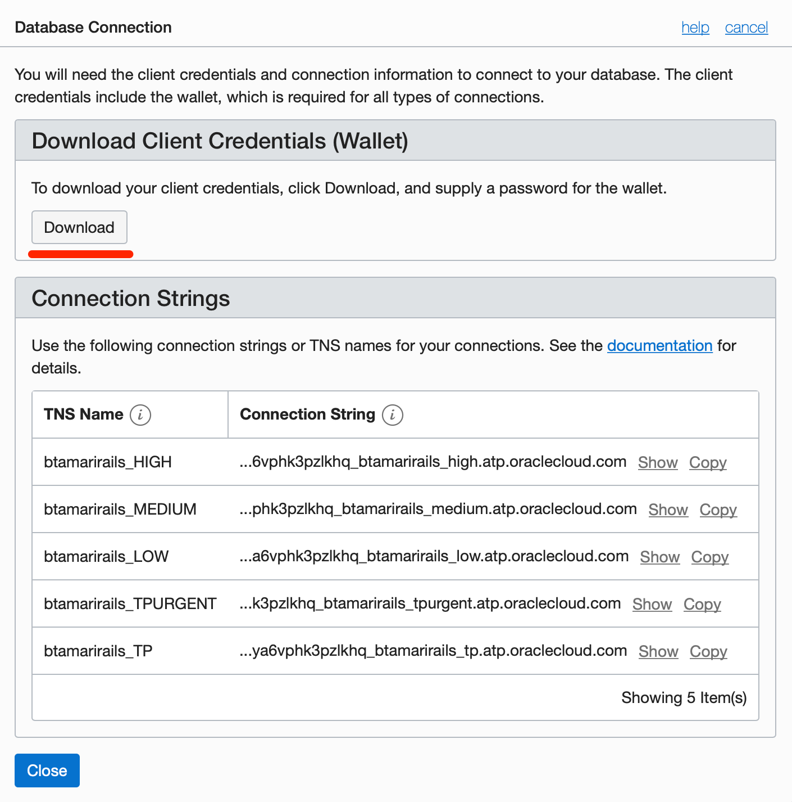
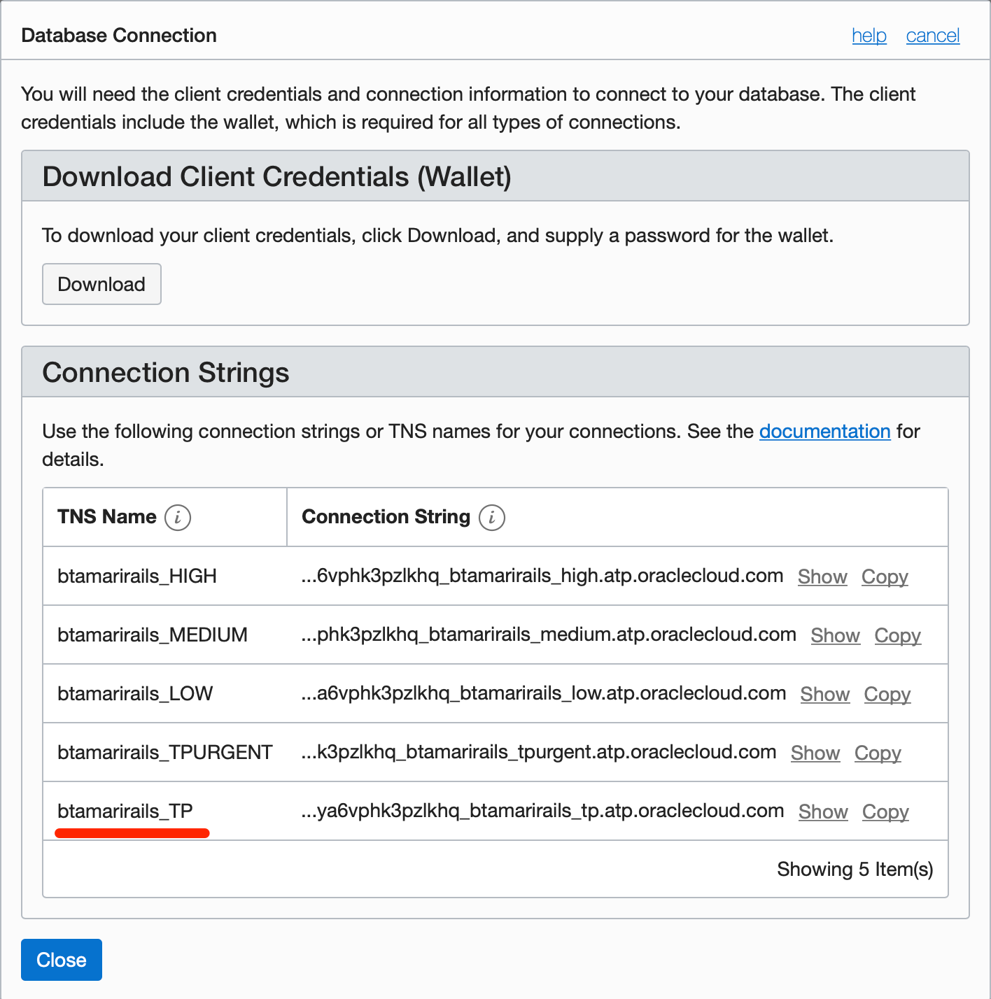

# ハンズオンご案内

## はじめに


当ハンズオンでは、Oracle Autonomous DBを利用した各言語での開発に必要な環境設定方法の確認と動作の体験をゴールとしております。


# OCI のトライアル環境へのアクセスと環境セットアップ(Lab.1)

## アプリケーションの実行環境となる仮想マシンのためのベースとなるイメージのインポート

今回のハンズオンでは、予めハンズオン主催者側で作成しておいた Oracle Linux 7 の仮想マシンイメージを使用して、アプリケーションの実行環境を作成します。
その利用にあたり、まずはその仮想マシンイメージをみなさまのそれぞれの環境にカスタム・イメージとしてインポートする作業を行います。この作業には少し時間がかかるため、最初に行っておくことで、ハンズオンがスムーズに進むようになります。

### 作業ステップ
1. コンソールメニューから **コンピュート → カスタム・イメージ** を選択し、**イメージ・インポート** ボタンを押します

1. 立ち上がったウィンドウに以下の項目を入力し、下部の **イメージ・インポート** ボタンを押します
    - **コンパートメントに作成** - デフォルトで現在のコンパートメントが選択されています。もし別のコンパートメントに作成したい場合は選択します。
    - **名前** - 任意の文字列
    - **オペレーティング・システム** - Linuxを選択
    - **オブジェクト・ストレージURL** - 以下の文字列をコピー&ペースト
        `https://objectstorage.ap-tokyo-1.oraclecloud.com/n/orasejapan/b/code19-coding-hol/o/code19-coding-hol`
    - **イメージ・タイプ** - OCI を選択
    - **起動モード** - グレーアウトされるので選択不要
    



インポート中というステータスの画面が表示されていたら、バックグラウンドで アプリケーションの設定済イメージのインポート作業が開始されていますので、別の画面へと遷移してしまってもOKです。カスタム・イメージのインポートが完了すると、コンソール上の状態が **使用可能** になります。
完了までにはしばらく時間がかかるので、その間に次の作業を開始してしまいしょう。


## Autonomous Database の作成

さて、いよいよ今回のメインディッシュ、Autonomous Database をクラウド上に作成します。Autonomous Database は、自律型の Oracle Database のマネージドサービスで、組み込みのAIによって管理が自動化されています。現在のところ、Oracle Cloud Infrastructure(OCI) でのみ使用が可能です。
今回は、OCIのコンソールから Autnomous Database を作成していきましょう。

### 作業ステップ
1. コンソールメニューから **Autonomous Transaction Processing** を選択し、**Autonoous Databaseの作成** ボタンを押します




1. 立ち上がったウィンドウに以下の項目を入力し、下部の **Autonomous Databaseの作成** ボタンを押します
    - **ワークロード・タイプ** - AUTONOMOUS TRANSACTION PROCESSING を選択
    - **コンパートメント** - デフォルトで現在のコンパートメントが選択されています。もし別のコンパートメントに作成したい場合は選択します。
    - **表示名** - 任意の文字列
    - **DATABASE NAME** - orcl
    - **CPUコア数** - 1
    - **ストレージ(TB)** - 1
    - **パスワード** - 任意のパスワード(後で使用します)
    - **ライセンス・タイプ** - SUBSCRIBE TO NEW DATABASE SOFTWARE LICENSES AND THE DATABASE CLOUD SERVICE を選択





バックグラウンドで Autnomous Database の作成が開始します。作成にはしばらく時間がかかるので、その間に次の作業を開始してしまいしょう。Autonomous Database の作成が完了すると、コンソール上の状態が **使用可能** になります。


## クラウドに仮想ネットワーク(VCN)を作る

アプリケーションの稼働環境となる仮想マシン・インスタンスを作成するには、クラウド上に仮想的なプライベート・ネットワーク(Virtual Cloud Network : VCN) を予め作成しておく必要があります。最初にネットワークの管理者が仮想ネットワークを作ることで、その後インスタンスの管理者やストレージの管理者が、作成した仮想ネットワークの構成やルールに従ってコンポーネントを配置することができるようになります。
今回はコンソール画面からテンプレートに従って仮想クラウド・ネットワーク(VCN)を1つ作成し、後のステップでそこにアプリケーションを実行する仮想マシン・インスタンスを配置します。

### 作業ステップ
1. コンソールメニューから **ネットワーキング(Networking) → 仮想クラウド・ネットワーク(Virtual Cloud Networks)** を選択し、**仮想クラウド・ネットワークの作成** ボタンを押します

1. 立ち上がったウィンドウに以下の項目を入力し、下部の **仮想クラウド・ネットワークの作成** ボタンを押します
    - **名前** - 任意[^1] (画面では TutorialVCN と入力しています)
    - **コンパートメントに作成** - デフォルトで現在のコンパートメントが選択されています。もし別のコンパートメントに作成したい場合は選択します。
    - **仮想クラウド・ネットワークおよび関連リソースの作成** - ラジオボタンを選択します。このオプションを選択すると仮想クラウド・ネットワーク(VCN)と付随するネットワーク・コンポーネントが事前定義済のテンプレートに従って作成され、簡単にクラウド上の仮想ネットワークの利用を開始することができます。

    [^1]:名前は識別しやすい名前をつけてください。VNC名は一意である必要はありませんが、同じ名前をつけた場合にコンソールでの識別が難しくなります。一度つけた名前は、コンソールからは名前を変更できません。(APIを利用すると名前を変更できます)




1. すべてのアクションが正常に実行されたことをメッセージで確認し **閉じる** ボタンを押しウィンドウを閉じます

1. コンソール上に作成した仮想クラウド・ネットワークが表示され、状態が **使用可能** になっていることを確認します


以上で仮想クラウド・ネットワークの作成は完了です。


## DBへのデータロード(Optional)

※　このプロセスは、言語別の講師から指定があったときに実行してください。

アプリケーションの実行環境インスタンスを作成する前に、先ほど作成した Autnomous Database に、サンプルのスキーマとデータをロードしてしまいましょう。
Autonomous Database は、データベースのソフトウェアとしては通常の Oracle Database 18ｃ と同じように使用できますので、もし Oracle Database に詳しい方であればいつもの方法でデータをロードすることができますが、今回はクラウド上のコンソールに付属するツールを使ってデータを取り込んでみましょう。

### 作業ステップ

1. SQL DeveloperまたはOracle MLの画面を開きます
2. 講師の案内もしくはドキュメントの記載をトレースします

# Autonomous Databaseについて

イメージインポート完了待ちの間、講師よりプレゼンテーションを行います。


## アプリケーション実行用のインスタンス作成と Autonomous Database への接続確認


### 作業ステップ

1. コンソールメニューから **コンピュート → カスタム・イメージ** を選択し、先ほどインポートしておいたイメージが表示され、状態が **使用可能** になっていることを確認します。

1. イメージ欄の右端の **・・・** メニューをマウスオーバーし、 **インスタンスの作成** を選択します

    


1. 立ち上がったウィンドウに以下の項目を入力し、下部の **作成** ボタンを押します
    - **インスタンスの命名** - 任意の名前
    - **インスタンスの可用性ドメインを選択します** - 可用性ドメイン1 を選択
    - **オペレーティング・システムまたはイメージ・ソースを選択します** - インポートしたカスタム・イメージを選択(デフォルトのまま)
    - **インスタンス・タイプの選択** − 仮想マシン を選択
    − **インスタンス・シェイプの選択** - シェイプの変更 ボタンをおして、VM.Standard2.2 を選択し、下部の **シェイプの選択** ボタンを押す
    - **ブート・ボリュームの構成** - 全てチェックなし(デフォルトのまま)
    - **SSHキーの追加** - **ファイルの選択** ボタンを押して予め作成しておいた鍵ペアのうち公開鍵(通常は id_rsa.pub )を選択
    - **仮想クラウド・ネットワーク** - 先ほどのステップで作成したVCNを選択
    - **サブネット** - 任意のパブリック・サブネットを選択
    


1. インスタンスの作成処理がバックグラウンドで作成されます。しばらくするとインスタンスの状態が **実行中** になり、使用できるようになります

    


1. 作成したインスタンスにSSHでアクセス確認します。
インスタンスの詳細画面の **プライマリVNIC情報** セクションにある **パブリックIPアドレス** 欄のIPアドレスをコピーし、そこに対してローカルのPCからSSHでアクセスします。アクセスする際の認証には、インスタンスを作成する際に登録したSSH公開鍵のペアとなる秘密鍵(通常はid_rsaという名前です)を使用してください。秘密鍵にパスコードを指定している場合はそちらも適切に指定してください。

アクセスするユーザーは　opc  です。

```text
localpc% ssh -i <your_secret_key> opc@<your_innstance_address>

remote%
```


2. アクセスしたインスタンスで、以下のようにWalletファイルを配置します。





Walletのコピー
```sh
localpc% scp -i <YourIdentitySecretKey> <YourWallet>.zip opc@<your_innstance_address>:
```

Walletの配置
```text
remote% sudo cp <YourWallet>.zip /usr/local/etc/
remote% cd /usr/local/etc/
remote% sudo unzip <YourWallet>.zip
```

3. sqlnet.oraのWallet配置先の記載を現状にあわせて修正します。

```text
remote% sudo cp sqlnet.ora sqlnet.ora.org && cat sqlnet.ora.org | sudo sh -c "sed -e 'N;s/\?\/network\/admin/\/usr\/local\/etc/g' > sqlnet.ora"
```

参考：環境変数設定（今回のインスタンスでは事前設定済み）

- ファイルの配置先は環境変数TNS_ADMINで設定します
- LD_LIBRARY_PATHにOracle client libの位置を与えます。

※ MacOSの場合はLD_LIBRARY_PATHの設定が制限されていますので、インスタンスまたはDocker上Linuxでの試用を推奨します。

```text
ハンズオン環境設定済み：
echo 'export LD_LIBRARY_PATH="/usr/lib/oracle/18.5/client64/lib"' >> ~/.bash_profile
echo 'export TNS_ADMIN="/usr/local/etc"' >> ~/.bash_profile
```

4. sqlplusからのAutonomous DB接続確認


作成したAutonomous DBのインスタンスのTNS nameを確認し、TP用のTNS名をメモします。




sqlplusのコマンドで、

例：
```text
remote% sqlplus admin@<インスタンス名>_tp

Password: Oracle123456(インスタンス作成時にadmin設定したパスワード）
```


## 各アプリケーション・フレームワークごとの作業(Lab.2)

各言語ごとのグループに別れて開始してください