# ライフサイクル管理

## インスタンスをスケールアップ・スケールダウンする

Autonomous DBは簡単なコンソール操作・コマンド操作やAPI経由での

ScaleUp/Downのボタンを押します。CPU数を2にしてみましょう。CPUは時間課金(新規ライセンスで約201円、BYOLで約58円)です。

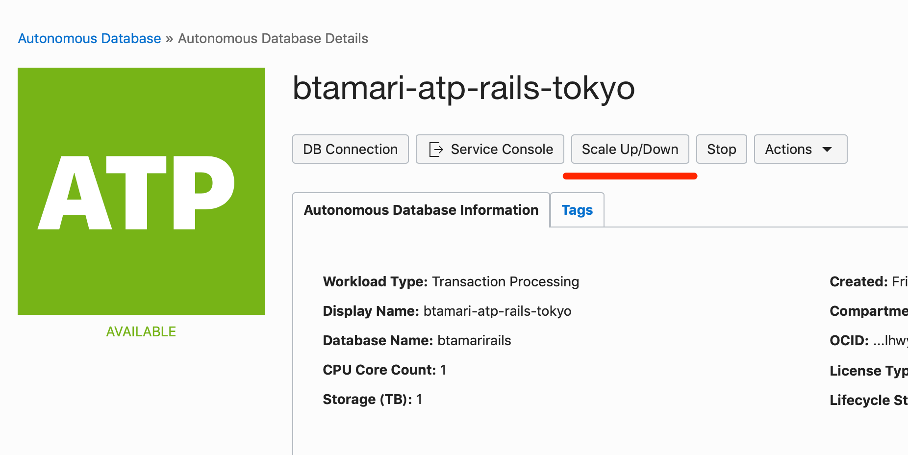

CPUカウントを2に増やし、Updateボタンを押します

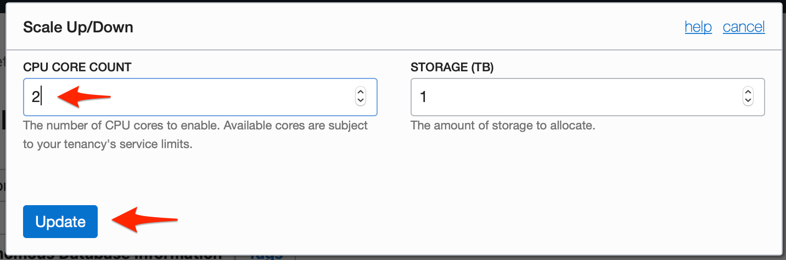

画面がScaling in processになります。実行中のSQLには影響を与えません。数分でスケールアップされます。スケールダウンも同様です。

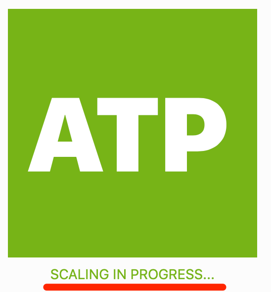

## インスタンスを停止する・再開する

Autonomous DBではインスタンスを停止することでOCPU課金を停止することができます。開発環境であれば夜間や休日など未利用時は停止しておくことで料金の節約ができます。

※ストレージ課金は、インスタンスを削除しないかぎり発生します。

Stopボタンを押します。

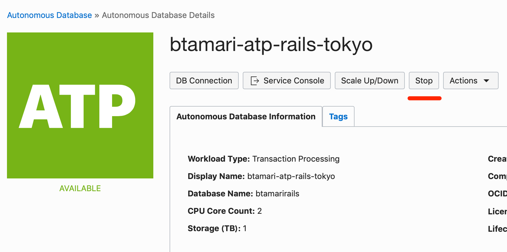

確認画面でもう一度Stopを押します

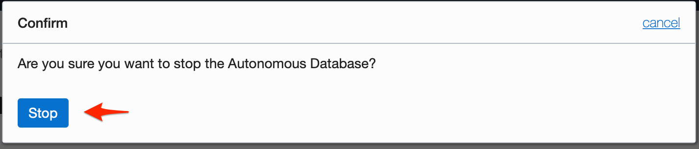

ステータスがstoppingになります。

stoppedになりました。

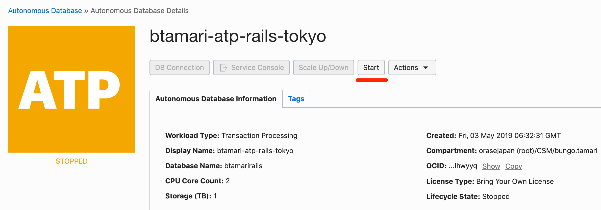

## インスタンスを削除する

課金を完全に停止するためには、インスタンスを削除します。

メニューからTerminateを選択します。

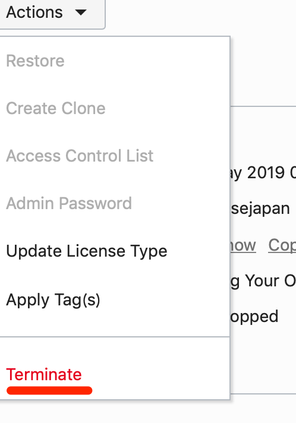

確認のため、DB名を入力します。

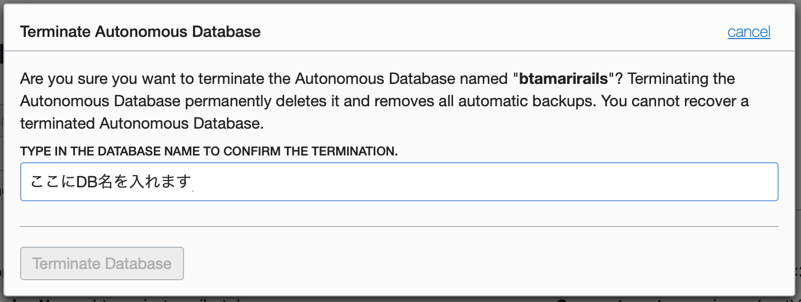

## DB接続元を制限する

Autonomous DBは強力な暗号Walletで通信データを暗号化していますが、特定のIPアドレスからの接続のためのACLを用意しています。

Access Control Listを押します

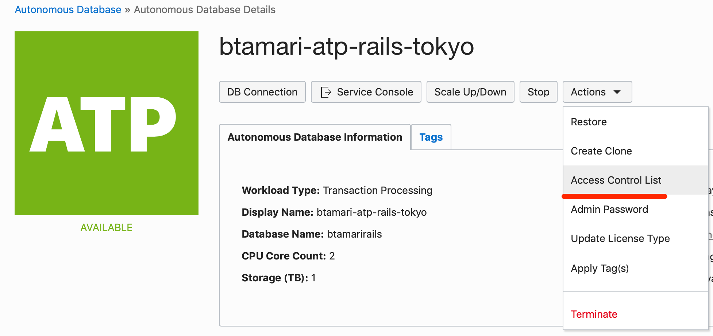

接続元のIP Address/CIDRを入力します。

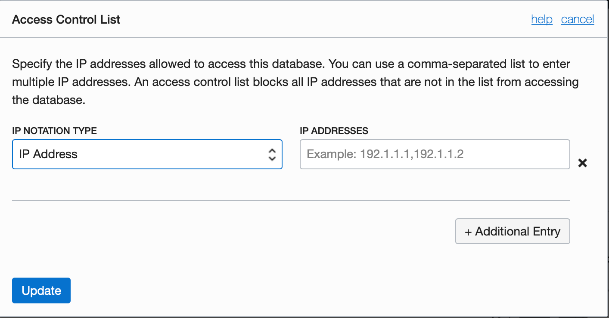

# Oracle MLを使う

### ユーザーの作成

サービスコンソールを開きます。画面がポップアップするので、ブラウザでポップアップを許可してください。

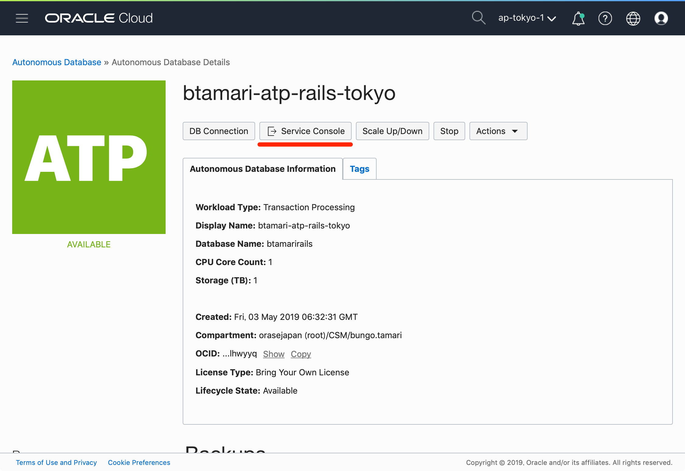

Administrationのタブを開きます

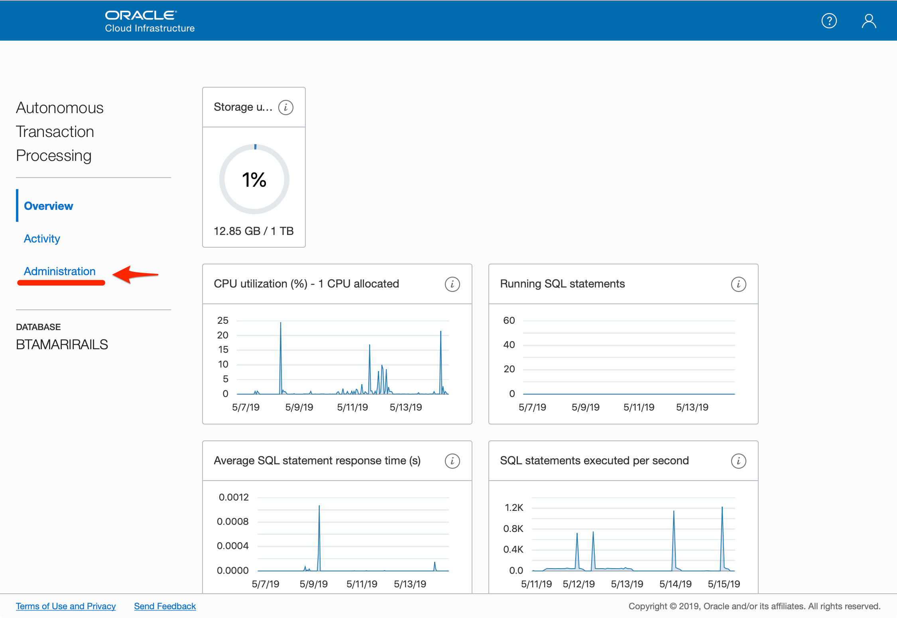

Manage Oracle Usersのメニューを開きます

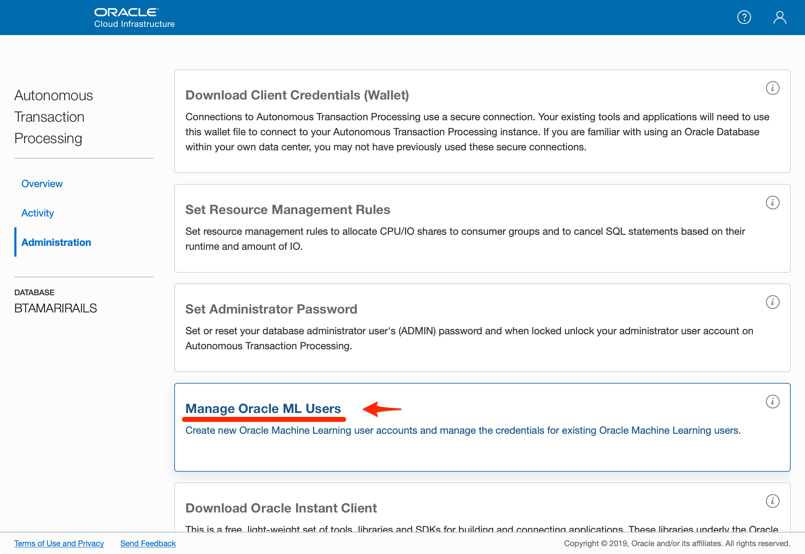

ユーザーの追加を行います。

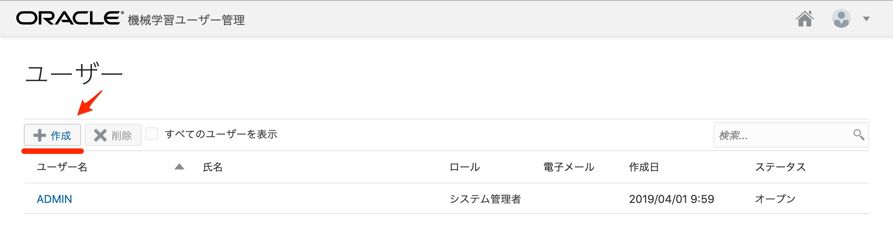

情報を入力して右上の作成ボタンを押してください。

- ユーザー名: app
- パスワード: Oracle123456

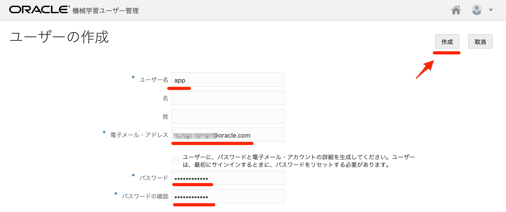

### Notebookへのログイン

ユーザーができたら右上の「家」のアイコンを押して、ノートブックに移動します。

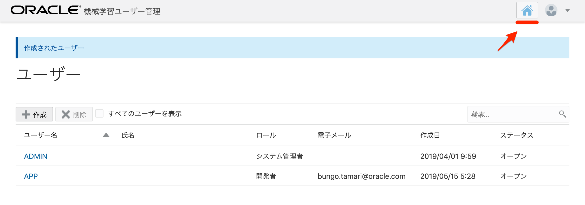

認証画面が出ましたら、先程設定したユーザー名とパスワードでログインします

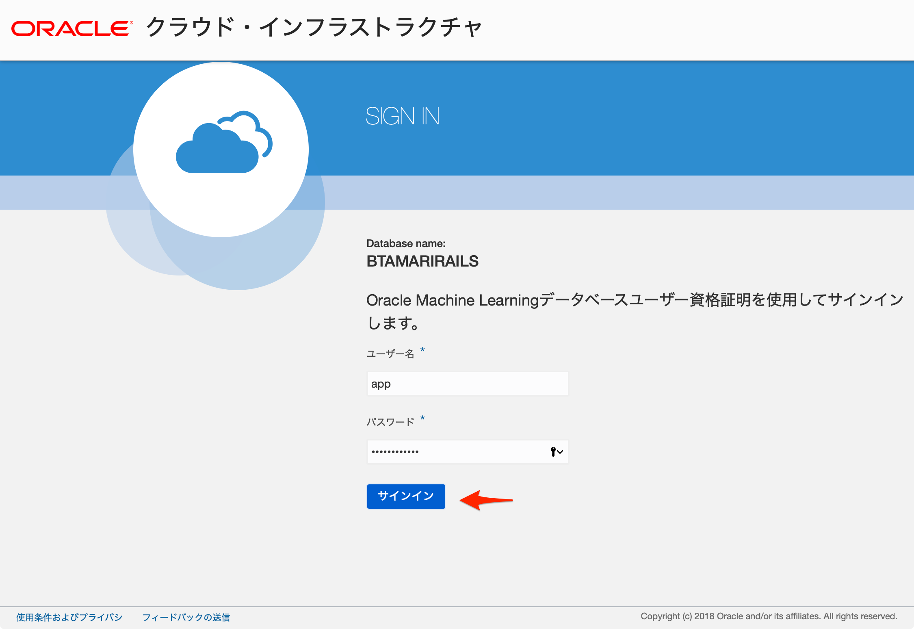

ホーム画面の、「SQL文の実行」をクリックします。

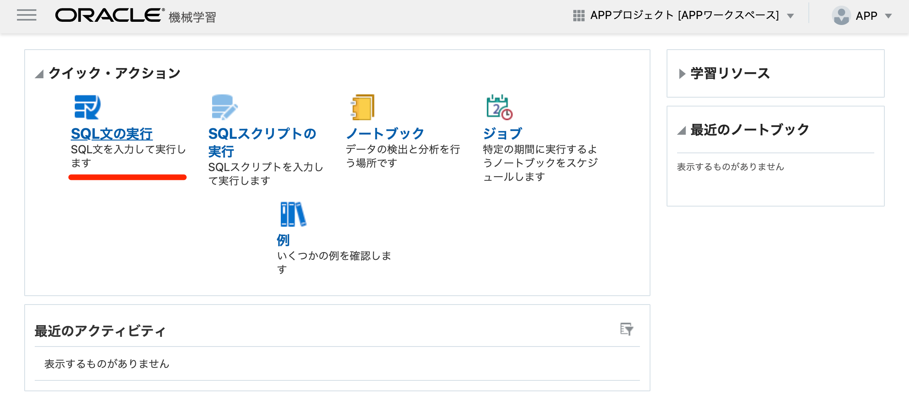

ノートブックが表示されたら、SQL文を入力してブロック実行の右矢印を押します。

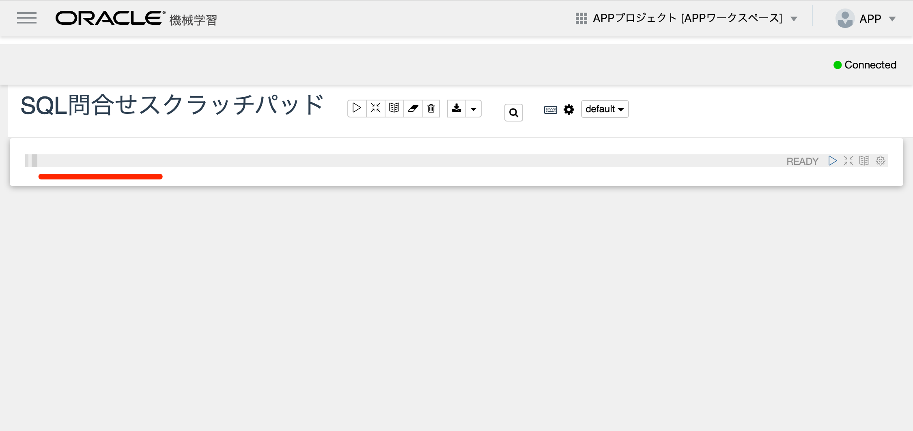

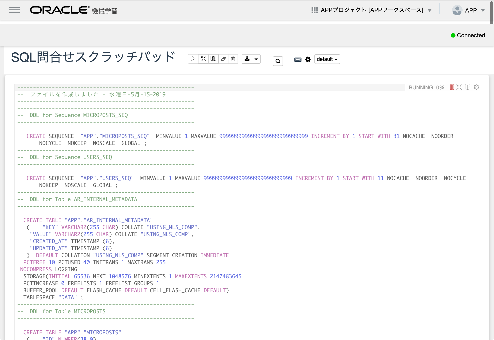

