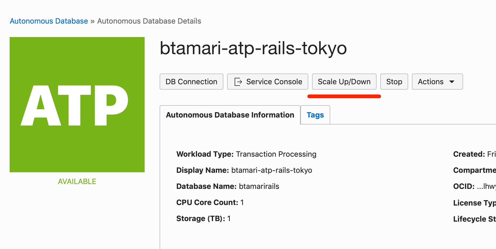
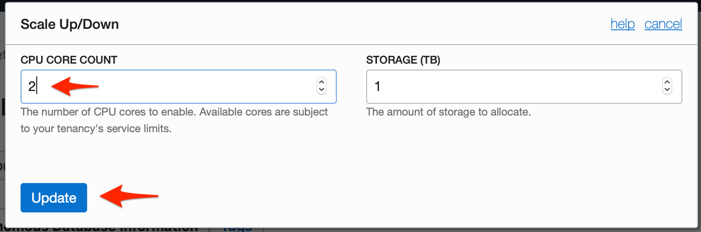
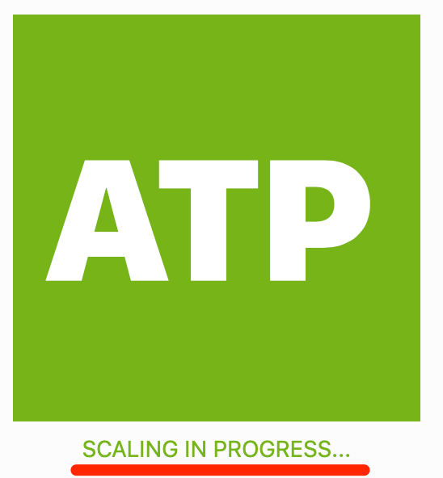
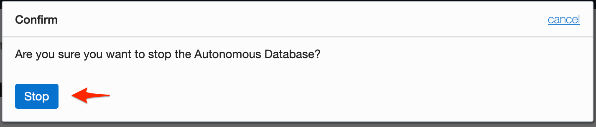
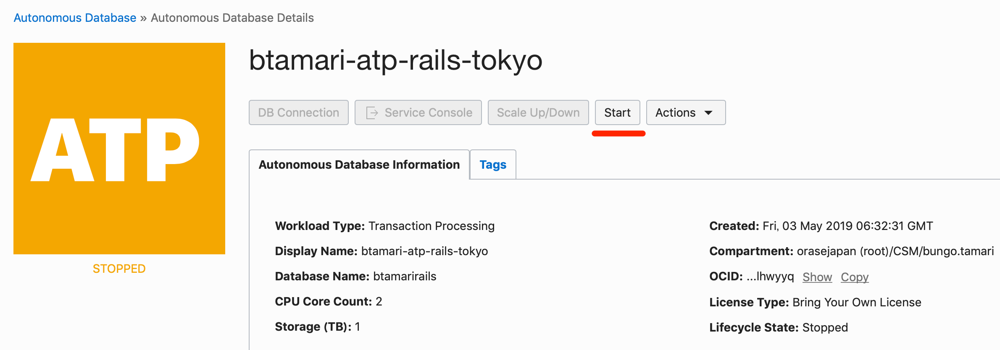

# インスタンスをスケールアップ・スケールダウンする

Autonomous DBは

ScaleUp/Downのボタンを押します。CPU数を2にしてみましょう。CPUは時間課金(約201円)です。

# インスタンスを停止する・再開する

Autonomous DBではインスタンスを停止することでOCPU課金を停止することができます。開発環境であれば夜間や休日など未利用時は停止しておくことで料金の節約ができます。

※ストレージ課金は、インスタンスを削除しないかぎり発生します。

# Oracle MLを使う

### ユーザーの作成

サービスコンソールを開きます。画面がポップアップするので、ブラウザでポップアップを許可してください。

Administrationのタブを開きます

Manage Oracle Usersのメニューを開きます

ユーザーの追加を行います。

情報を入力して右上の作成ボタンを押してください。

- ユーザー名: app
- パスワード: Oracle123456

### Notebookへのログイン

ユーザーができたら右上の「家」のアイコンを押して、ノートブックに移動します。

認証画面が出ましたら、先程設定したユーザー名とパスワードでログインします

ホーム画面の、「SQL文の実行」をクリックします。

ノートブックが表示されたら、SQL文を入力してブロック実行の右矢印を押します。

